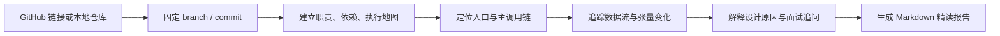

# GitHub Project Tutor

面向零基础读者的 GitHub 项目源码精读 Skill。

给出一个 GitHub 仓库链接或本地源码目录，它会从项目入口开始追踪目录职责、模块导入、运行调用链和数据流，并生成一份能够独立阅读的 Markdown 精读文件。

对于深度学习项目，它不会停留在“这一层叫 Attention”或“shape 变成了 `[B,N,D]`”，而会继续解释：

- 每个轴分别表示什么；
- 数据为什么这样变换；
- 哪个轴改变、哪个轴保持；
- 当前实现解决了什么问题；
- 为什么采用这种设计；
- 有什么收益和代价；
- 是否存在等价实现；
- 参数变化如何影响计算量、显存和信息保留；
- 面试中可能怎样继续追问。

## 目录

- [适合谁使用](#适合谁使用)
- [核心能力](#核心能力)
- [工作方式](#工作方式)
- [使用前提](#使用前提)
- [安装](#安装)
- [快速开始](#快速开始)
- [常用提示词](#常用提示词)
- [深度学习项目专项能力](#深度学习项目专项能力)
- [输出文件](#输出文件)
- [项目结构](#项目结构)
- [证据与安全原则](#证据与安全原则)
- [适用范围与限制](#适用范围与限制)
- [常见问题](#常见问题)

## 适合谁使用

- 第一次阅读大型 GitHub 项目的初学者；
- 想了解一个项目从入口到最终输出如何运行的开发者；
- 需要接手、复现或审查陌生代码库的研究人员；
- 希望系统学习 Dataset、模型 Forward、Loss 和训练循环的人；
- 准备深度学习、计算机视觉、NLP 或生成模型面试的人；
- 希望把零散源码分析整理成长期保存文档的人。

## 核心能力

| 能力 | 说明 |
|---|---|
| 仓库基线固定 | 记录仓库、branch/tag、commit 和分析日期，避免源码变化后结论失效 |
| 项目地图 | 整理关键目录、文件职责、导入关系和推荐阅读顺序 |
| 入口追踪 | 从 CLI、脚本或服务入口追踪到真正的业务函数 |
| 调用链还原 | 区分“文件导入关系”和“运行时函数调用关系” |
| 数据流追踪 | 记录数据从原始输入到最终输出经过的每个关键阶段 |
| 张量形状账本 | 记录变量、轴含义、shape、dtype、device、操作和下游消费者 |
| 逐操作解释 | 详细解释 tokenize、pad、cat、reshape、transpose、QKV、broadcast 等操作 |
| 设计原因分析 | 回答为什么这样实现、解决什么问题、收益与代价是什么 |
| 模拟面试追问 | 生成从基础事实到故障诊断的递进问题，并给出参考答案 |
| 证据分级 | 区分运行验证、代码确认、数学推导、合理推断和暂未确认 |
| 文件化交付 | 默认生成带目录、公式、源码链接和附录的 Markdown 精读报告 |

## 工作方式



分析时同时维护两条主线：

```text
数据轨：
输入 → 预处理 → Batch → 模型模块 → Loss/采样器 → 后处理 → 输出

设计轨：
上游约束 → 当前选择 → 数学机制 → 收益 → 代价
→ 替代方案 → 边界条件 → 最小验证
```

## 使用前提

- 支持 Skills 的 Codex 环境；
- 分析远程 GitHub 仓库时需要能够访问对应仓库；
- 分析本地仓库时需要提供可读取的源码路径；
- 使用 `repo_probe.py` 辅助扫描时需要 Python 3；
- 纯静态源码分析不要求 GPU，也不要求下载模型权重。

## 安装

### 方式一：放入个人 Codex Skill 目录

将整个 `github-project-tutor` 目录复制到：

```text
$CODEX_HOME/skills/github-project-tutor
```

如果没有设置 `CODEX_HOME`，默认使用：

```text
~/.codex/skills/github-project-tutor
```

Windows PowerShell 示例：

```powershell
Copy-Item -Recurse -Force `
  .\github-project-tutor `
  "$env:USERPROFILE\.codex\skills\github-project-tutor"
```

macOS/Linux 示例：

```bash
mkdir -p "${CODEX_HOME:-$HOME/.codex}/skills/github-project-tutor"
cp -R github-project-tutor/. "${CODEX_HOME:-$HOME/.codex}/skills/github-project-tutor/"
```

复制完成后，开始一个新任务并使用 `$github-project-tutor` 调用。

### 方式二：作为工作区内 Skill 使用

如果暂时不想安装到个人目录，可以保留当前文件夹，并在提示词中明确给出 Skill 路径：

```text
使用 C:\path\to\github-project-tutor 中的 $github-project-tutor，
分析下面的 GitHub 仓库……
```

## 快速开始

### 1. 读懂一个 GitHub 项目

```text
使用 $github-project-tutor 分析：
https://github.com/owner/repository

请面向零基础读者生成完整 Markdown 精读文件。
```

### 2. 读懂本地仓库

```text
使用 $github-project-tutor 分析本地项目：
C:\projects\my-model

重点解释程序入口、文件调用关系和完整推理流程。
```

### 3. 分析深度学习数据流

```text
使用 $github-project-tutor 读懂这个深度学习项目。

从 Dataset、transform、collate 和 batch 开始，追踪到模型 forward、
loss、backward、optimizer.step 和推理后处理。

每一步都解释 tensor shape、dtype、device 和每个轴的含义。
```

### 4. 只精读一个模型模块

```text
使用 $github-project-tutor 精读 model.py 中的 PatchEmbed 和 Attention。

除了数据形状变化，还要解释设计原因、复杂度、参数量、替代方案、
边界条件，并给出面试式递进问题和参考答案。
```

### 5. 固定版本分析

```text
使用 $github-project-tutor 分析下面仓库的指定 commit：
https://github.com/owner/repository/commit/<commit-id>

所有源码证据链接必须固定到该 commit。
```

### 6. 可选：手动运行仓库索引脚本

`repo_probe.py` 只负责快速发现文件、入口和模型/Dataset 符号候选，不会代替完整源码分析：

```bash
python scripts/repo_probe.py /path/to/repository --format markdown
```

输出应被视为阅读索引，不能把动态注册、配置注入或运行时调用从结果中直接推断出来。

## 常用提示词

### 小白精读模式

```text
我没有相关项目经验。请不要默认我理解 batch、channel、token、
hidden size、reshape、broadcast 或 attention。

首次出现每个术语时都解释，并用具体数字展示 shape 变化。
```

### 数据流模式

```text
选择一个真实样本，从文件读取开始贯穿整个项目。

每个阶段写明：变量名、现实含义、输入 shape、操作、输出 shape、
dtype、device、下游消费者和代码位置。
```

### 模拟面试模式

```text
对每个 P0 关键模块增加模拟面试追问。

按照“基础事实 → 数学机制 → 设计动机 → 权衡替代
→ 边界条件与调试”递进，并在每道问题后给参考答案。
```

### 训练链路模式

```text
重点检查训练链路：Dataset、Sampler、DataLoader、Forward、Loss、
梯度累积、AMP、梯度裁剪、Optimizer、Scheduler、EMA 和验证指标。

如果仓库没有某部分代码，请明确说明缺失，不要用论文常识补写。
```

### 推理链路模式

```text
只分析推理流程，从用户输入追踪到最终输出文件。

区分模型输入、模型原始输出、采样/解码、后处理和文件保存。
```

### 对比模式

```text
比较训练与推理两条调用链，指出复用模块、不同配置、
不同数据 shape、train/eval 模式差异和仅训练时存在的操作。
```

## 深度学习项目专项能力

### 逐轴解释

Skill 不会只写：

```text
[B,D,H,W] → [B,N,D]
```

而会说明：

```text
B：同时处理多少个样本
D：每个空间位置的特征通道数
H/W：二维网格的高和宽
N：展平后的空间位置或 patch token 数

flatten：合并了哪两个轴
transpose：交换了哪两个轴
元素总数是否变化
下游为什么需要 [batch, token, feature] 布局
```

### 设计原因与面试追问

关键模块按照重要性分级：

| 级别 | 典型操作 | 追问数量 |
|---|---|---:|
| `P0` | PatchEmbed、Downsample、QKV、跨模态融合、采样更新、Loss | 4–8 |
| `P1` | LayerNorm、残差、门控、激活函数 | 2–4 |
| `P2` | Getter、薄包装、明显样板代码 | 0–1 |

以 PatchEmbed 为例，除 shape 外还会追问：

- 为什么使用 `Conv2d(kernel=P,stride=P)`？
- 它与 `unfold + Linear` 在什么条件下等价？
- 为什么不能直接把 `[B,D,H_p,W_p]` 裸 `reshape` 成 `[B,N,D]`？
- Patch size 翻倍时 Token 数和 Attention 复杂度怎样变化？
- 参数量为什么是 $DCP^2+D$？
- 输入尺寸不能整除 $P$ 时会 padding、截断还是报错？
- 构造函数中的 flag 是否真的在 `forward()` 中生效？
- 如何构造最小张量验证轴没有被错误重排？

### 张量形状账本

报告使用类似下面的结构记录关键数据：

| 位置/变量 | 数据含义 | 输入 shape | 操作 | 输出 shape | dtype/device | 下游 | 证据 |
|---|---|---|---|---|---|---|---|
| `x_embedder(x)` | latent patch | `[B,16,H,W]` | Conv + flatten + transpose | `[B,N,D]` | fp16/CUDA | JointBlock | 代码确认 |

### 常见高认知负担操作

以下操作会被重点展开：

- tokenizer、token id、embedding、padding 和 mask；
- `cat` 与 `stack`；
- `reshape/view/flatten`；
- `permute/transpose`；
- `unsqueeze/squeeze` 与 broadcast；
- convolution、pooling、downsample、upsample；
- Q/K/V 拆分、多头变换和注意力矩阵；
- residual、normalization、gating；
- loss flatten、mask、reduction；
- sampler、latent、decode 和后处理。

## 输出文件

除非明确要求只在聊天中回答，否则默认生成：

```text
reports/<owner>-<repository>-beginner-guide.md
```

报告通常包含：

```text
0. 如何阅读本报告
1. 分析基线与项目边界
2. 30 秒读懂项目
3. 先补齐的基础概念
4. 推荐源码阅读顺序
5. 项目目录与文件关系
6. 程序入口和完整调用链
7. 一份真实数据的端到端旅程
8. 核心模型逐模块拆解
9. 训练、推理、评估与输出闭环
10. 配置、权重和复现
11. 常见疑问与易错点
12. 证据等级、未确认项与下一步
附录 A. 完整张量形状账本
附录 B. 术语与符号表
附录 C. 代码证据索引
```

同一仓库的后续修订默认更新同一份文件。

## 项目结构

```text
github-project-tutor/
├─ README.md
├─ SKILL.md
├─ agents/
│  └─ openai.yaml
├─ references/
│  ├─ beginner-explanation-standard.md
│  ├─ deep-learning-tracing.md
│  ├─ design-rationale-interview.md
│  └─ report-template.md
└─ scripts/
   └─ repo_probe.py
```

| 文件 | 用途 |
|---|---|
| `SKILL.md` | Skill 的核心工作流、触发范围和质量门槛 |
| `agents/openai.yaml` | Codex 界面名称、说明和默认提示词 |
| `references/beginner-explanation-standard.md` | 零基础术语、轴和算子解释规范 |
| `references/deep-learning-tracing.md` | Dataset、模型、Loss、训练与推理的端到端追踪规范 |
| `references/design-rationale-interview.md` | 设计动机、收益代价、替代方案和模拟面试规则 |
| `references/report-template.md` | 最终 Markdown 文件的章节模板和完稿检查 |
| `scripts/repo_probe.py` | 快速生成仓库文件、入口和符号候选索引 |

## 证据与安全原则

### 证据等级

| 等级 | 含义 |
|---|---|
| `运行验证` | 通过测试、最小输入、hook 或日志实际观察到 |
| `代码确认` | 可由源码、配置和算子静态确定 |
| `数学推导` | 由已确认 shape 和公式推导得到 |
| `合理推断` | 有明确依据，但缺少运行时数据或完整代码 |
| `暂未确认` | 缺少权重、数据、动态配置或第三方资源 |

### 安全原则

- 默认先进行静态分析；
- 不自动执行不可信仓库代码；
- 不自动安装未知依赖或运行安装钩子；
- 不默认下载大型数据集或模型权重；
- 运行验证优先使用现有测试、合成输入和低成本 shape hook；
- 无法验证时明确标记，不把猜测写成源码事实。

## 适用范围与限制

支持 Python、PyTorch、TensorFlow、JAX 以及常见非 Python 项目，但 `repo_probe.py` 对 Python 的入口和模型符号识别最完整。

以下情况需要额外信息或运行验证：

- 配置由 registry、反射、插件或远程服务动态生成；
- 关键源码位于 Git submodule、Git LFS 或未公开依赖；
- 模型结构由 checkpoint shape 决定，但没有提供权重；
- 数据集、训练代码或评估脚本没有包含在仓库中；
- 实际行为依赖 CUDA kernel、编译扩展或特定硬件；
- 私有仓库没有提供访问权限；
- 超大 monorepo 没有指定需要分析的子项目。

Skill 只会解释仓库能够证明的内容。例如推理仓库不包含 Dataset、Loss 和 Optimizer 时，会明确说明缺失，而不会自行补出一条虚构训练链路。

## 常见问题

### 一定要运行项目吗？

不一定。入口、调用链和大部分 shape 可以通过源码静态确认。只有静态信息不足且运行成本安全可控时，才进行最小运行验证。

### 可以只分析某个文件或模块吗？

可以。提供具体文件、类或函数，并说明希望追踪它的上游输入和下游消费者。即使只分析一个模块，也会先建立足够的调用上下文。

### 可以分析指定 branch、tag 或 commit 吗？

可以。推荐提供 commit，因为这样报告中的源码链接和结论不会随主分支变化。

### 为什么默认生成 Markdown 文件？

复杂项目的调用链、公式和 shape 账本通常很长。文件便于搜索、修订、版本管理和后续继续学习，也避免重要内容只存在于聊天上下文。

### 会自动下载模型权重吗？

不会。下载大型权重、数据集或安装依赖需要额外成本和授权。没有权重时，报告会区分哪些 shape 可以由代码确认，哪些只能保持符号形式。

### 模拟面试问题会不会变成通用题库？

不会。问题必须绑定当前仓库的变量、算子、配置和调用位置。只有当前代码能够支持的问题才应进入报告。

### 如何要求更细的讲解？

可以在提示词中明确要求：

```text
把每个 P0 模块拆到单个 shape 操作。
每一步都回答为什么这样设计、替代方案、复杂度、参数量、
失败条件和最小验证，不要只给最终 shape。
```
